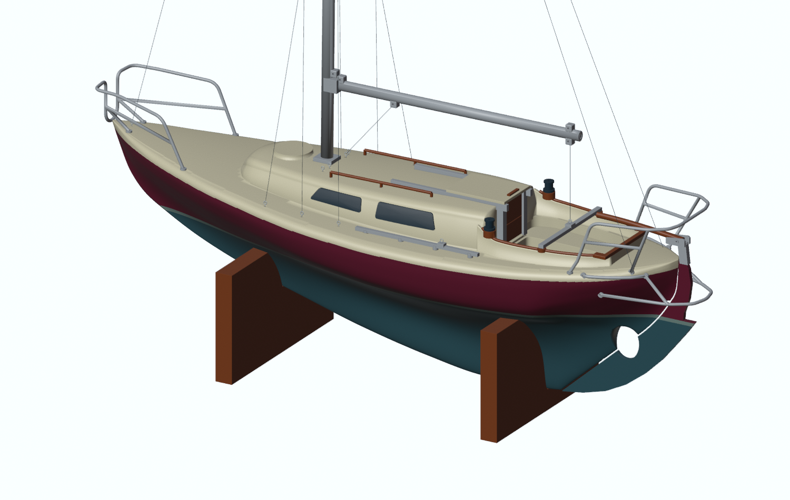
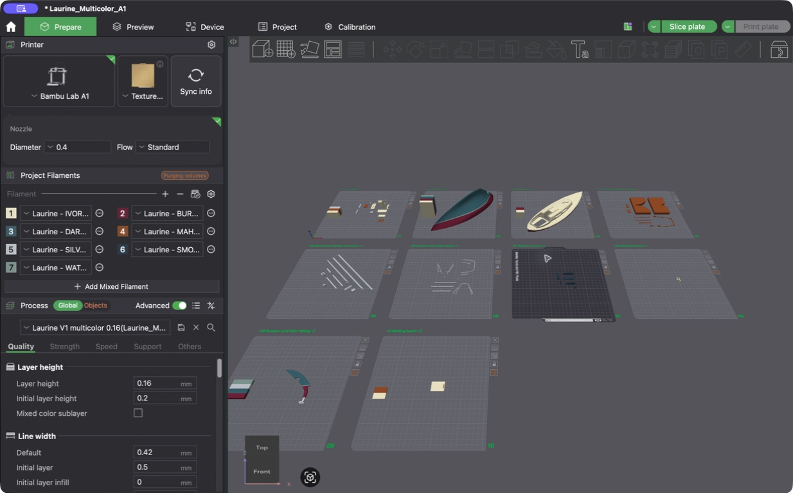
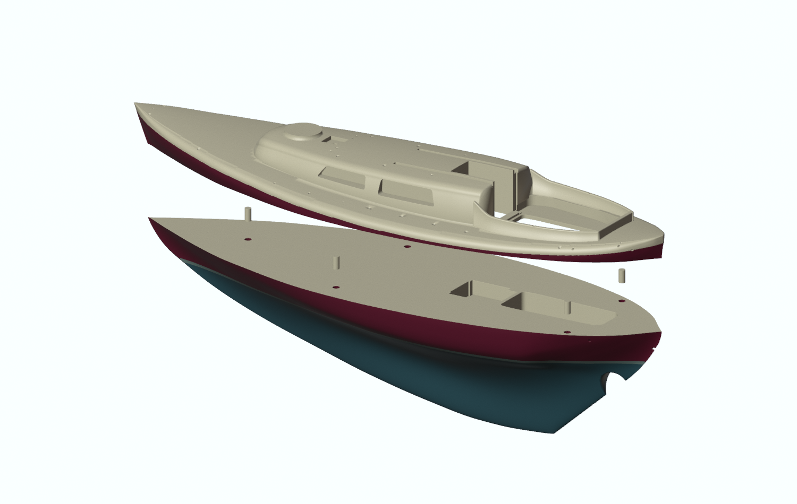
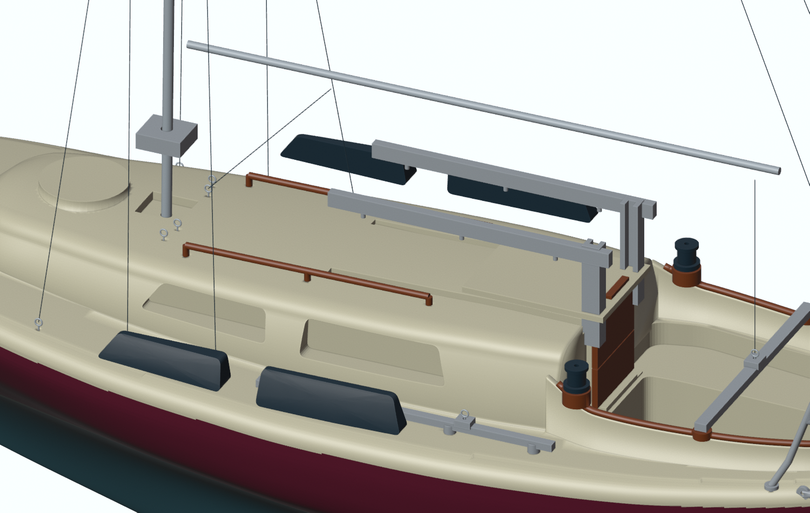
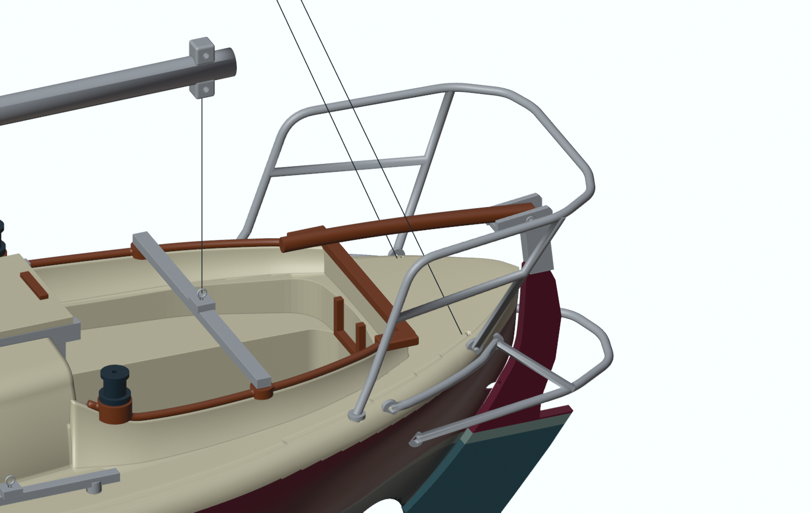

# Laurine · Laurin Koster L28

### A small model of a much-loved sailing boat

A **1:30 display model of Laurine**, made for Laurin Koster owners and anyone who enjoys these boats. Print the parts, add a few metal rods and some rigging thread, then bring her together on the workbench.

**278 mm hull · 400 mm mast height above the waterline · seven colours**

This is the **current development model**, ready for a first test build. Version 1 remains available as an earlier release. The parts have been checked digitally and sliced, but a complete physical build has not yet been tested. The shape follows photographs and reference material; it is a personal interpretation of Laurine, with details that may differ from other L28s.

## Get the model

| You want to… | Start here |
|---|---|
| Download everything for a build | [Current project files](print) · [Earlier Version 1 release](https://github.com/SebastienTr/laurinkosterl28/releases/tag/v1.0.0) |
| Open all the printing plates together | [Bambu Studio project · .3mf](https://github.com/SebastienTr/laurinkosterl28/raw/refs/heads/main/print/Laurine_Multicolor_A1.3mf) |
| Look around the assembled boat or change a detail | [Blender model · .blend](https://github.com/SebastienTr/laurinkosterl28/raw/refs/heads/main/model/Laurine_L28.blend) |
| Find one replacement part | [Individual parts](print/stl) · [Fit-test pieces](print/fit-tests) |
| Understand how it goes together | [Illustrated assembly guide](docs/ASSEMBLY_GUIDE.md) |
| Choose colours and materials | [Colour and filament guide](docs/FILAMENT_SHOPPING_LIST.md) |

You do **not** need Blender or any scripts to print the model. Open the `.3mf` **as a project** in Bambu Studio, select your printer and filaments, and begin with **plate 01: fit tests**.

*One project, ten plates: from the long-keel hull to the smallest fittings. Print and assemble at your own pace.*

## A boat you can build in stages

The long-keel hull stays in one full-length piece. The deck lifts off horizontally, with five concealed pins to help line up the joint. Glue, a little filler and a matching paint touch-up will help the seam disappear.

The windows, timber details and stainless-coloured fittings are separate pieces. That makes finishing easier and keeps glue away from the visible surfaces. The companionway has two wooden washboards and a sliding hatch. The rig has twin backstays. Two longer mast sleeves meet inside the spreader collar around a continuous 2 mm metal core; the one-piece boom takes a 1.5 mm core. Both have thicker sidewalls and lie diagonally on their printing plate.

## What you will need

- A filament printer, **1.75 mm PLA**, and the seven colours in the [colour guide](docs/FILAMENT_SHOPPING_LIST.md). Every plate uses at most four colours at once.
- **2 mm, 1.5 mm and 1 mm metal rod**, plus **0.8 mm pins**, for the spars and small fittings.
- Fine thread for the standing and running rigging, plus 0.3 mm wire for small attachment eyes.
- Light sail material and the printable cutting patterns below.
- Suitable glue, a small file, fine abrasive paper and a little matching paint for the hull seam.

The supplied project is prepared for a **Bambu Lab A1 with a 0.4 mm nozzle**. For a P1S or another printer, select the correct machine and slice again before printing. The ten plates are estimated at **about 24.6 hours and 427 g of PLA**, including supports, colour changes and test pieces. Actual results depend on the printer and materials.

Print the fit tests first, assemble the hull and deck, finish the seam, then add the windows, timber, fittings and rig. The [assembly guide](docs/ASSEMBLY_GUIDE.md) takes you through each stage.

## Cut the sails and rig the boat

The model has two winches, side sheet tracks, a mainsheet traveller and attachment holes for a simple thread rig. Its aft timber caps are one joined piece. The tiller is located by a small metal cross-pin.

Print the [A4 sail cutting patterns](docs/sails/Laurine_Sails_1-30.pdf) at **100%** and check the 50 mm calibration line. Join the matching marks, try the sails in paper, then cut your chosen material. No hem allowance is included.

| Sail | Luff | Foot | Leech |
|---|---:|---:|---:|
| Mainsail | 313.3 mm | 110.0 mm | 330.2 mm |
| Genoa | 346.7 mm | 139.1 mm | 314.5 mm |

These are flat templates fitted to the **1:30 model**, not plans for full-size sails. Follow the [illustrated rigging guide](docs/RIGGING_GUIDE.md) for eyelets, twin backstays, halyards and sheets. The [cutting list](docs/sails/CUTTING_LIST.md) gives starting thread lengths with extra for knots.

## Do you sail a Laurin Koster?

Corrections from owners are welcome—especially details of the cockpit, stern fittings and rig. [Share an observation or a build report](https://github.com/SebastienTr/laurinkosterl28/issues). Tell us which boat or detail you are comparing, and include a measurement or photograph if you are happy for it to be public.

Personal reference photographs are kept out of this repository. The pictures above are model renders and a Bambu Studio screenshot.

## Take Laurine sailing, too

My other project, [VSail](https://github.com/SebastienTr/VSail), is a sailing simulator built around Laurine. It explores sail trim, wind and waves, with the aim of bringing the feel of sailing her to the screen.

For people who want to work on the model

The editable model is in `model/`; the build tools are together in `tools/`. Intermediate files go into an ignored `build/` folder. Git records changes instead of keeping numbered generation folders. See [development notes](docs/DEVELOPMENT.md).

