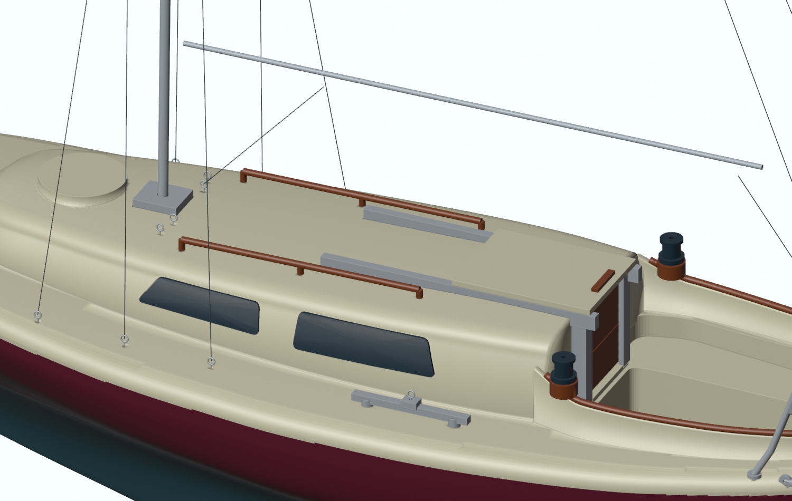
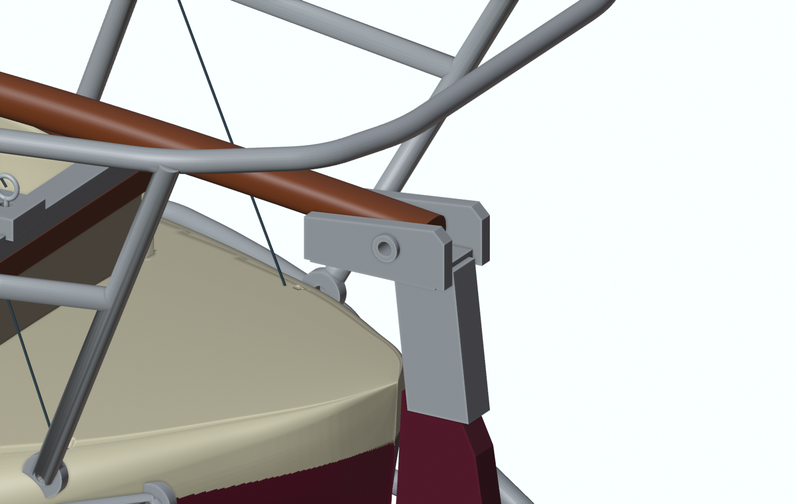

# Laurine — hybrid display model, 1:30

Open `Laurine_Multicolor_A1.3mf` **as a project** in Bambu Studio. It contains all printable parts, ten named plates, print orientations and seven color assignments. The `.blend` file shows the assembled model. Individual STL files are backups without color information.

The hull remains 278 mm long. It is separated horizontally from the deck, never across its length. The mast top is 400 mm above the model waterline, corresponding to the owner's 12 m measurement.

## Separate pieces and fittings

Four curved window inserts are separate parts, each with a flat printing face and a matching recessed glue seat. Their visible surfaces follow the cabin shape. The edges and back have a nominal 0.15 mm glue allowance. Each window projects approximately 0.25 mm beyond the cabin surface. These are solid, dark display inserts, not transparent panes.

Five additional metal-colored pieces are separate: two vertical companionway channels, two horizontal sliding-hatch rails, and the mast deck shoe. The channels and shoe sit in recessed seats with 0.15 mm nominal clearance. Each horizontal rail has three hidden 0.9 mm locating pins and corresponding 1.15 mm sockets. The bow pulpit, stern pushpit and lower rudder guard were already separate and remain so. Rigging eyelets are small metal-wire fittings installed in the existing pilot holes.

The two wood handrails remain separate, each with three 0.9 mm pins, 1.2 mm long, in 1.15 mm sockets. The local rudder/keel straight-edge correction below the propeller opening is retained. Use the supplied lower hull and rudder together.

## Printing and colors

The project uses the installed Bambu Studio 02.08.03.66 A1 machine templates, a 0.4 mm nozzle and 0.16 mm layers. The filament profiles are provisional Generic PLA profiles. Set and calibrate the actual purchased materials, then re-slice. For a P1S or Centauri Carbon, change the machine profile and re-slice; the included G-code is for the A1 only.

Every plate uses at most four colors. Project IDs 1–7 are not physical AMS Lite slot numbers. Load the required spools and map the active project colors to the four physical slots before each plate. Preserve the plate grouping.

| ID | Target color | Screen reference |
|---|---|---|
| 1 | Ivory | #E6DFC0 |
| 2 | Burgundy | #6C2037 |
| 3 | Dark teal | #355C66 |
| 4 | Mahogany brown | #8C4825 |
| 5 | Silver grey | #B8BEC4 |
| 6 | Smoked glazing | #263B48 |
| 7 | Waterline grey-green | #79918B |

Commercial recommendations and purchase links are in `FILAMENT_SHOPPING_LIST.md`. The target colors are based on photographs, not measurements of the boat.

## Fit tests first

Plate 01 contains five test blocks and extra copies of two washboards, one alignment pin, both companionway channels, and the mast shoe. These six extra copies are for test fitting; do not add them to the completed model.

The hull-joint coupon offers 3.15 / 3.25 / 3.35 mm holes, in that order from the notched end, for the 3 mm alignment pin. The mast-rod coupon offers 2.2 / 2.3 / 2.4 mm holes for a 2 mm metal core. The companionway coupon receives the two metal channels before testing the removable washboards. Test the mast shoe on its matching step coupon.

Print the window plate early. Check the fit of the first inserts in the finished cabin before gluing. The nominal clearances still need physical validation with your printer and filament. Remove burrs gently; do not force the thin rails or pulpit tubes.

## Assembly order

1. Print the test plate, then the lower hull and upper deck in their supplied orientations. The lower hull prints upside down on its large horizontal joint face; the upper deck prints upright on its joint face.
2. Clean supports and test-fit the five hidden 3 mm × 6 mm alignment pins. The sockets are 3.25 mm in diameter and 3.2 mm deep on each side. The seam lies 17 mm above the miniature waterline, within the burgundy topsides. Glue only after the perimeter sits flush.
3. Finish the hull/deck seam before mounting small details. A truly invisible joint requires local filling, sanding and matching burgundy paint. Multicolor printing alone does not hide a glue seam.
4. Glue the mast shoe, the two vertical channels and the two horizontal hatch rails into their seats. Keep the channels' grooves and the mast-core bore free of glue. Present the hatch and washboards while checking alignment, then remove them until the glue has cured.
5. Fit each window from outside into its matching seat. `PORT` is the boat's left side when facing forward; `STARBOARD` is the right. Window 1 is forward, window 2 aft. Use a small amount of PLA-compatible glue on the concealed rear face. Keep it off the visible face.
6. Glue the joined coaming-cap assembly, the small cockpit trim and the handrails. Fit the tiller with its cross-pin. The two 1.2 mm washboards slide upward out of the 1.6 mm grooves; the horizontal hatch slides toward the bow and can be lifted off. Leave these three closing panels unglued if you want them removable.
7. Assemble the spars and rigging, then the pulpits and rudder guard. Work with light thread tension and protect the small printed tubes during handling.

See the [rigging and sail guide](RIGGING_GUIDE.md) for the new winches, tracks, traveller, metal eyes and sail templates.

## Metal rods, pins and rigging

The three mast sleeves use a continuous 2 mm brass core. Start with approximately 378 mm, including about 18 mm in the foot, and trim after dry fitting. The 120 mm boom uses a 1 mm core. The spreader collar sits about 190 mm above the mast foot; a 1 mm metal crossbar gives a finished spreader span of about 56 mm. Use fine model thread for the stays, including the two confirmed backstays. These rods and threads are assembly references in Blender's `DO NOT PRINT` collection, not exported parts.

The rudder uses two short 0.8 mm metal pins, cut to fit and glued. The tiller heel sits between the silver yoke cheeks with roughly 0.25 mm side clearance per side. A 0.8 mm cross-pin passes through the 0.9 mm bore in the yoke and tiller heel; trim it after dry fitting.

The pulpit tubes are 1.4 mm in diameter, intentionally thickened at model scale. The bow pulpit and two forward stern-pushpit feet use 1.2 mm pins in 1.5 mm deck sockets. Eight small side plates—two on the upper stern pushpit and six on the lower guard—use 0.8 mm metal pins in 0.9 mm holes, with about 2.5 mm available depth into the hull. Dry-fit, trim pins and glue after hull finishing. The printed pulpits can also serve as references for making a metal-wire version.

## Verification and limitations

The current mesh inventory, triangle checks and plate checks are recorded in the delivery reports. Each printable part must be closed, connected and have positive volume. The 3MF is compared against the same final Blender export for geometry and colour consistency.

No physical print has yet validated the fits, fine tubes, support removal or filament colors. Start with the fit tests. This is a display model reconstructed from photographs and available reference material, not a surveyed engineering model.

[Back to the boat](../README.md)
