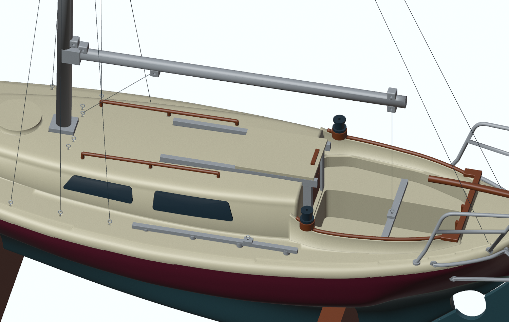

# Rigging Laurine

Start with the bare hull and fitted deck. Finish the paint and glue joints before adding thread. This is a display rig: use just enough tension to take out the slack.

## Small eyes, simple knots

Use **0.3 mm brass or stainless wire** for the eyes and **0.15–0.25 mm model thread** for the ropes. Wind the wire around a 1 mm drill shank, leave a 2 mm stem, and glue the stem into a deck pilot hole. Keep the loop clear of glue. Open the nominal **0.8 mm pilot holes** gently with a hand pin vice; do not use a powered drill against the thin parts. Test the wire and glue in the rigging coupon first. Its three holes are 0.7, 0.8 and 0.9 mm from left to right in the assembled Blender view.

The mast and boom have external tabs with **1 mm transverse holes**. Pass the thread through the tab or fit a small wire loop. These holes avoid the metal cores. Tie a small loop at each metal spreader end, around the rod, before installing it. Do not drill through the 1 mm spreader rod.

The wire eyes and thread lines visible in Blender are assembly references, not printed parts. The actual holes and spar tabs are included in the printing project. Knot and glue a short sample before rigging the boat.

## Install the standing rigging first

1. Fit the mast's 2 mm metal core and the spreader rod. Set the masthead 400 mm above the miniature waterline.
2. Run the forestay from the bow eye to the forward masthead tab.
3. Fit **two independent backstays**, one to each stern eye, both secured through the aft masthead tab. Sharing that head fitting does not turn them into a single backstay.
4. Fit a cap shroud on each side: deck eye abreast the mast, spreader tip, aft masthead tab. Retain the thread at the spreader tip with a small wire loop.
5. Add forward and aft lower shrouds on both sides, from the two remaining side eyes to the tab below the spreaders.
6. Adjust opposite sides gradually. Secure each knot with a very small amount of suitable glue, then trim its tail.

Each side has three chainplate eyes at **94, 112 and 130 mm aft of the bow**, 32 mm from the centreline. The backstay eyes are at 264 mm aft and 13 mm either side. The forestay eye is 10 mm aft of the bow. These are model assembly positions, not surveyed measurements of the full-size boat.

[Thread cutting lengths and attachment names](sails/CUTTING_LIST.md) include 40 mm extra per listed standing line for tying. The [interface map](../source/rigging.json) records the positions used in the model.

## Add the sails

Download the [four-page A4 cutting patterns](sails/Laurine_Sails_1-30.pdf). Print at **100% / Actual size**, not Fit to page. Measure the 50 mm line on every page. Match the registration crosses of the lower and upper tiles, tape the paper, then try the shape against the assembled rig before cutting cloth.

Use light, non-fraying sail material or thin paper for a first build. The solid outline is the **finished edge with no hem allowance**. If your material needs a folded hem, add your chosen allowance outside the outline. Reinforce the three corners with tiny patches, then pierce the patches for thread. Do not enlarge holes by pulling hard on the sail.

- **Mainsail:** lace the luff loosely around the mast, clear of the spreader collar. Tie the tack at the boom's forward upper tab. Lead a halyard from the head through the aft masthead tab and down to a mast-foot eye. Tie the clew to the upper boom-end tab with an outhaul. Keep the foot loose between tack and clew.
- **Genoa:** attach small thread hanks around the forestay. Tie the tack at the bow eye and lead the head halyard through the forward masthead tab to the other mast-foot eye. The head sits below the masthead, leaving room for the halyard.

The mainsail's 313.3 mm luff and 110 mm foot follow the 9.4 m / 3.3 m dimensions in the L28 association's 1998 handbook. The remaining outlines fit **this model**: they are flat, straight-edged templates without a sailmaker's roach, broadseaming or camber. They do not claim to reproduce Laurine's actual sail inventory. Earlier [Laurin sail plans](https://digitaltmuseum.se/011024761748/ritning) show a different 9.7 m / 3.8 m mainsail. The owner's 12 m waterline-to-masthead measurement sets the model mast height; it is not a sail luff length.

## Sheets, tracks and winches

The **mainsheet traveller** spans the middle of the cockpit, 225 mm aft of the bow. The car is directly below the boom sheet tab, so the centred sheet hangs almost vertically. The 40 mm rail rests directly on the cockpit seats, below the timber coaming caps. Its two 0.9 mm locating pins are 36 mm apart and fit 1.15 mm sockets in the seats. Dry-fit the rail on both seats before gluing. The centre car has an eyelet pilot hole. It is fixed for this display model.

Lead the mainsheet from the lower boom-end tab to the traveller car, back to the boom tab and back to the car. This simple two-pass representation replaces working miniature blocks. Leave the line slack enough to pose the boom. Attach the vang from the lower forward boom tab to a mast-foot eye.

There are two separate dark winches on the forward cockpit coamings. Each uses a 1.2 mm locating pin and a 1.5 mm socket in its timber backing pad. Lead each genoa sheet from the clew, through the eye in its side track car, then around the winch. The timber backing pads are small model assembly allowances, not surveyed fittings on the boat. The winch's top socket is a detail; wrap the sheet around the drum. Each genoa track is 60 mm long, extending from 138 to 198 mm aft of the bow, 31 mm either side of the centreline. This represents a provisional 1.80 m full-size length, estimated from the photographs and the owner’s correction, not a measured dimension. The fixed cars sit at 180 mm aft, ahead of the winches, and have 0.8 mm eyelet pilots. Each track has four locating pins and matching deck sockets.

The pulpits and lower rudder guard remain separate assemblies because the reference boat has separate hull/deck attachments. Within each assembly the tubes are connected. Lash lifelines around the pulpit rails if desired; do not drill through the 1.4 mm printed tubes. These rails are not standing-rigging anchors.

## Tiller and proportions

The tiller heel and metal-coloured yoke now share a **0.9 mm transverse bore**. Dry-fit a 0.8 mm metal pin, trim it to approximately 5.8 mm, then secure its ends. The cheeks retain clearance around the timber heel. This locates the display tiller reliably; it is not a tested working steering mechanism.

The stern top rail is about 20 mm above its forward foot level, representing roughly 600 mm full size. This height is retained as a photographic estimate, not a confirmed measurement. The 1.4 mm tubes are deliberately thicker than strict scale for printing. The [association's rigging page](https://www.laurinkostersallskapet.se/?page_id=42) provides a separate L28 masthead example; fittings vary between boats.

All new fits, eyelets, support removal and thread tension still need a physical test build.

[Back to assembly](ASSEMBLY_GUIDE.md) · [Back to Laurine](../README.md)
